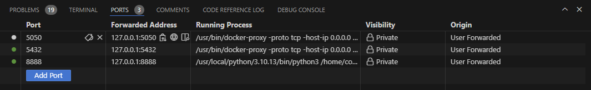

# Steps to building docker image

* Write docker compose file with services `postgresdb` and `pgadmin` for database with a network `pg-network` that houses both the database server and its client.

* create network in docker
```docker create network pg-network```

* Run docker compose
```docker-compose up```

* connect to database on terminal via pgcli.
```pgcli -h localhost -p 5432 -u postgres -d new_york_taxi```

* download data from the internet
```wget url```

* Open Jupyter notebook and write script to ingest data to database.

* I encountered issues with my port not forwarding on codespaces especially for my pgadmin container.

`Resolution`: All I simply did was to add the port with the port number on the port tab of the cli.

